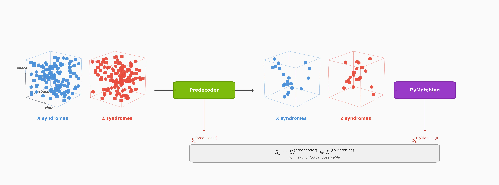
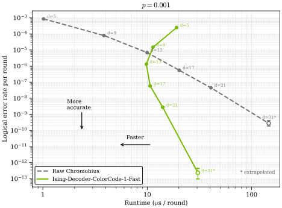

# Ising Decoding

[](./LICENSE)
[](https://github.com/NVIDIA/Ising-Decoding/tree/releases/v0.1.0)
[](https://research.nvidia.com/publication/2026-04_fast-ai-based-pre-decoders-surface-codes)
[](https://research.nvidia.com/publication/2026-07_fast-and-accurate-ai-based-pre-decoders-color-codes)
[](https://www.python.org/downloads/)
[](https://huggingface.co/nvidia/Ising-Decoder-SurfaceCode-1-Fast)
[](https://huggingface.co/nvidia/Ising-Decoder-SurfaceCode-1-Accurate)

This repo offers AI training recipes to build, customize and deploy scalable quantum error correction **decoders**:

- A neural network consumes detector syndromes across space **and** time
- It predicts corrections that reduce syndrome density / improve decoding
- A standard global decoder produces the final logical decision (PyMatching for surface codes, Chromobius for color codes)

Two code families are supported, both driven by the same user-facing config (`conf/config_public.yaml`) — select with `code: surface` or `code: color`:

- **Surface code** — the primary path, with pre-trained models published on Hugging Face. PyMatching is the global decoder.
- **Color code** — Chromobius is the global decoder, on a Torch + cuStabilizer runtime. The public-config validator fills in the color-specific circuit/data defaults; `code: color` training additionally needs the augmented-DEM precompute step described in [Color code support](#color-code-support).

The public release exposes a **single user-facing config** and a **single runner script** for both families.



## Table of Contents

- [Publication](#publication)
- [High-level workflow](#high-level-workflow)
- [Quick start (train + inference)](#quick-start-train--inference)
- [Dependencies](#dependencies)
- [Troubleshooting](#troubleshooting)
- [Inference (pre-trained models)](#inference-pre-trained-models)
- [Model export and downstream tools](#model-export-and-downstream-tools)
  - [Converting .pt checkpoints to SafeTensors](#converting-pt-checkpoints-to-safetensors-optional-post-training)
  - [ONNX export and quantization](#onnx-export-and-quantization-optional-post-training)
  - [Generating data for CUDA-Q QEC](#generating-data-for-cuda-q-qec-realtime-predecoder-test-application)
  - [Offline decoding from Stim detector samples](#offline-decoding-from-stim-detector-samples)
  - [Decoder ablation study with cudaq-qec](#decoder-ablation-study-with-cudaq-qec-optional)
- [Configuration and advanced usage](#configuration-and-advanced-usage)
  - [GPU selection](#gpu-selection)
  - [Public configuration](#public-configuration-confconfig_publicyaml)
  - [Precomputed frames](#precomputed-frames-recommended)
  - [Resuming training and running inference](#resuming-training-and-running-inference-on-a-trained-model)
  - [Color code support](#color-code-support)
- [Logging and outputs](#logging-and-outputs)
  - [What gets written where](#what-gets-written-where)
  - [Evaluation defaults](#evaluation-defaults-public-release)
- [Testing and CI](#testing-and-ci)
  - [Testing (CPU + GPU)](#testing-cpu--gpu)
  - [CI (GitHub Actions)](#ci-github-actions)
- [Results](#results)
- [License](#license)

## Publication

This implementation accompanies two papers, one per code family.

**Surface codes:**

Christopher Chamberland, Jan Olle, Muyuan Li, Scott Thornton, and Igor Baratta,
"Fast and accurate AI-based pre-decoders for surface codes,"
[arXiv:2604.12841](https://arxiv.org/abs/2604.12841), 2026.
[doi:10.48550/arXiv.2604.12841](https://doi.org/10.48550/arXiv.2604.12841)

**Color codes:**

Jan Olle, Christopher Chamberland, Muyuan Li, and Igor Baratta,
"Fast and accurate AI-based pre-decoders for color codes,"
[NVIDIA Research](https://research.nvidia.com/publication/2026-07_fast-and-accurate-ai-based-pre-decoders-color-codes), 2026. *(link goes live on publication)*

Please cite the paper for the code family you use if this repository supports research or published work.

## High-level workflow

```text
 ┌────────────────────────────────────────┐  Uses:
 │ 1. Train or Download Model             │  - Ising-Decoding repo (train)
 │                                        │  - Hugging Face (download)
 └──────────────────┬─────────────────────┘
                    │
                    ▼
 ┌────────────────────────────────────────┐  Uses:
 │ 2. Assess Performance                  │  - Ising-Decoding repo
 │    (Run inference tests)               │
 └──────────────────┬─────────────────────┘
                    │
 ┌──────────────────▼─────────────────────┐  Uses:
 │ 3. Investigate Realtime Performance    │  - Ising-Decoding repo (3a, 3b)
 │                                        │  - CUDA-Q QEC (3c)
 │   ┌────────────────────────────────┐   │
 │   │ 3a. Enable ONNX_WORKFLOW &     │   │
 │   │     choose quantization format │   │
 │   └──────────────┬─────────────────┘   │
 │                  │                     │
 │   ┌──────────────▼─────────────────┐   │
 │   │ 3b. Run generate_test_data.py  │   │
 │   └──────────────┬─────────────────┘   │
 │                  │                     │
 │   ┌──────────────▼─────────────────┐   │
 │   │ 3c. Take .onnx and .bin files  │   │
 │   │     into CUDA-Q QEC            │   │
 │   └────────────────────────────────┘   │
 └────────────────────────────────────────┘
```

## Quick start (train + inference)

From the repo root:

- `code/scripts/local_run.sh`

This script runs the Hydra workflow locally (no SLURM required) and reads **one** user-facing config file:

- `conf/config_public.yaml`

## Dependencies

Target Python versions: **3.11, 3.12, 3.13**.

Two minimal requirements files are provided:

- `code/requirements_public_inference.txt` (Stim + PyTorch path; includes `chromobius` for color-code logical-error-rate evaluation)
- `code/requirements_public_train-cuXY.txt` (training path, where XY = 12 or 13; CUDA build of `cuquantum-python` provides the cuStabilizer backend used by both code families)

Both code families (surface and color) run on the Torch + cuStabilizer training pipeline.

Install examples (virtual environment is optional but recommended):

```bash
# Optional: create and activate a virtual environment
python -m venv .venv
source .venv/bin/activate

# Optional: install CUDA-enabled PyTorch (example: pick any available cuXXX)
# Pick one that matches your CUDA runtime; cu130 is known to work.
export TORCH_CUDA=cu130

# Inference-only (training install is a superset)
pip install -r code/requirements_public_inference.txt

# Training (includes inference deps, adjust to cu13 as appropriate)
pip install -r code/requirements_public_train-cu12.txt

bash code/scripts/check_python_compat.sh
```

Tip: To force CUDA-enabled PyTorch, set `TORCH_CUDA=cuXXX` (recommended `cu13x`) or
`TORCH_WHL_INDEX=https://download.pytorch.org/whl/cuXXX` before running installs.

Quick start:

```bash
# Train (reads conf/config_public.yaml)
bash code/scripts/local_run.sh

# Inference (loads a saved model from outputs/<exp>/models/*)
WORKFLOW=inference bash code/scripts/local_run.sh
```

Inference note:

- On bare metal, keep the default DataLoader workers.
- In containers, set a larger shared-memory size (e.g., `docker run --shm-size=1g ...`).
- If you cannot change `--shm-size`, set `PREDECODER_INFERENCE_NUM_WORKERS=0` to avoid shared-memory worker crashes.
- Default evaluation is heavy (`cfg.test.num_samples=262144` shots per basis); expect inference to take time.

## Troubleshooting

- **Avoid `steps_per_epoch=0` on short runs**:
  - Keep `PREDECODER_TRAIN_SAMPLES >= per_device_batch_size * accumulate_steps * world_size`.
  - Note: the batch schedule jumps to 2048 after epoch 0, so epoch 1 uses
    `2048 * 2 * world_size` effective batch size.
  - For quick short runs, use `GPUS=1` and `PREDECODER_TRAIN_SAMPLES >= 4096`.
- **Segfaults during training startup (torch.compile)**:
  - Some environments crash during `torch.compile`.
  - Disable compile: `TORCH_COMPILE=0 bash code/scripts/local_run.sh`.
  - Or try a safer mode: `TORCH_COMPILE=1 TORCH_COMPILE_MODE=reduce-overhead bash code/scripts/local_run.sh`.
- **Multi-GPU SIGSEGV inside `libnccl.so.2` on the CUDA 12.8 stack (known issue)**:
  - The `torch 2.11.0+cu128` wheel pins `nvidia-nccl-cu12==2.28.9`, which has
    been observed to segfault on any multi-rank NCCL operation (DDP gradient
    sync, all-reduce) on H100x8 nodes running newer CUDA-13.x-family drivers.
    The CUDA 13.0 stack (NCCL 2.29.7) is unaffected on the same hardware.
  - Preferred: use the cu130 requirements/wheels on such nodes
    (`TORCH_CUDA=cu130`, `code/requirements_public_train-cu13.txt`).
  - If you must stay on cu128, upgrade NCCL in place. The torch wheel declares
    an exact `nvidia-nccl-cu12==2.28.9` dependency, so pip will report a
    dependency conflict for the upgrade — it is safe to proceed because
    `libnccl.so.2` is ABI-compatible (`--no-deps` keeps the rest of the CUDA
    package set untouched):
    ```bash
    pip install --no-deps --upgrade "nvidia-nccl-cu12>=2.29"
    ```
  - `export NCCL_NVLS_ENABLE=0` has also been reported to avoid the crash
    family on NVLink-Switch topologies; `NCCL_DEBUG=INFO` helps capture the
    crash site for bug reports.
- **Blackwell GPUs (RTX 5080/5090, GB200/GB300)**:
  - Stable PyTorch wheels (`cu124`) do not ship SM 12.0 kernels.
    Install the nightly build with the `cu128` index:
    ```bash
    pip install --pre torch --index-url https://download.pytorch.org/whl/nightly/cu128
    ```
- **Windows (Git Bash / WSL)**:
  - Triton is not supported on native Windows, which causes `torch.compile` to
    fail. Disable it before running:
    ```bash
    export TORCH_COMPILE_DISABLE=1   # PyTorch-level flag
    # or, equivalently for the repo scripts:
    export PREDECODER_TORCH_COMPILE=0
    ```
  - When running scripts directly (outside the notebook or `local_run.sh`),
    set the Python path so that repo modules are importable:
    ```bash
    export PYTHONPATH="code"
    ```
- **Pre-trained model not found during inference**:
  - `find_best_model` searches inside `{output}/models/best_model/` first,
    then falls back to `{output}/models/`. If you placed the downloaded
    `.pt` file elsewhere, either move it into one of those directories or
    point to it directly:
    ```bash
    PREDECODER_MODEL_CHECKPOINT_FILE=path/to/Ising-Decoder-SurfaceCode-1-Accurate.pt \
      WORKFLOW=inference bash code/scripts/local_run.sh
    ```

## Inference (pre-trained models)

If you are not training locally, you can run inference using pre-trained models.

1. **(Optional) create a venv and install inference deps**:

   ```bash
   python -m venv .venv
   source .venv/bin/activate
   python -m pip install --upgrade pip
   pip install -r code/requirements_public_inference.txt
   ```

2. **Get the pre-trained models**
   Two surface-code models are published on Hugging Face (they are licensed
   separately from the code in this repo and are not part of it):
   - [nvidia/Ising-Decoder-SurfaceCode-1-Fast](https://huggingface.co/nvidia/Ising-Decoder-SurfaceCode-1-Fast) (receptive field R=9)
   - [nvidia/Ising-Decoder-SurfaceCode-1-Accurate](https://huggingface.co/nvidia/Ising-Decoder-SurfaceCode-1-Accurate) (receptive field R=13)

   The models are access-controlled: sign in with a Hugging Face token
   (create one at <https://huggingface.co/settings/tokens>), then download
   the files into `models/`:

   ```bash
   pip install -U "huggingface_hub[cli]"
   hf auth login
   hf download nvidia/Ising-Decoder-SurfaceCode-1-Fast --local-dir models/
   hf download nvidia/Ising-Decoder-SurfaceCode-1-Accurate --local-dir models/
   ```

   See each model card for the available files and formats. The scripts below
   expect `models/Ising-Decoder-SurfaceCode-1-Fast.pt` and
   `models/Ising-Decoder-SurfaceCode-1-Accurate.pt`.

   These checkpoints target the uniform circuit-level depolarizing setting
   encoded by the public configs. Custom, non-uniform 25-parameter noise models
   are supported for training by the pipeline below; they are a training-time
   customization rather than a property of the published checkpoints.

3. Set:

   - `EXPERIMENT_NAME=predecoder_model_1`
   - `model_id: 1` in `conf/config_public.yaml`

4. **Run inference**:

   ```bash
   WORKFLOW=inference EXPERIMENT_NAME=predecoder_model_1 bash code/scripts/local_run.sh
   ```

Inference output is written to `outputs/<EXPERIMENT_NAME>/` with a full log in
`outputs/<EXPERIMENT_NAME>/run.log`.

## Model export and downstream tools

### Converting .pt checkpoints to SafeTensors (optional, post-training)

By default, training produces `.pt` checkpoints under `outputs/<EXPERIMENT_NAME>/models/` and inference loads them directly. SafeTensors export is optional — use it when downstream tooling requires the SafeTensors format.

**Step 1 — convert the best trained checkpoint:**

```bash
PYTHONPATH=code python code/export/checkpoint_to_safetensors.py \
    --checkpoint outputs/<EXPERIMENT_NAME>/models/<checkpoint>.pt \
    --model-id <MODEL_ID> [--fp16]
```

Output is written next to the checkpoint (e.g. `<checkpoint>_fp16.safetensors`).

**Step 2 — run inference from the SafeTensors file:**

```bash
PREDECODER_SAFETENSORS_CHECKPOINT=outputs/<EXPERIMENT_NAME>/models/<checkpoint>_fp16.safetensors \
WORKFLOW=inference bash code/scripts/local_run.sh
```

`MODEL_ID` is the public model identifier — 1–5 for surface-code checkpoints, or
B for the color-code cascade model; see `model/registry.py` for the mapping.
Color-code *convolutional* checkpoints (model_id 1/2/4/5 trained with
`code: color`) are not supported by this converter — color training widens the
final conv layer, so the rebuilt surface architecture cannot load them.
The pre-trained public models use `--model-id 1` (R=9) and `--model-id 4` (R=13).

### ONNX export and quantization (optional, post-training)

After training (or starting from the `.safetensors` files downloaded from Hugging Face), you can export the model to
ONNX and optionally apply INT8 or FP8 post-training quantization for deployment.

You may also change the code distance and number of rounds at inference
time. That is - you are not required retrain a new model when changing either
one of these parameters; since the model is a 3D convolutional neural network,
the model will simply be run over a new decoding volume. This holds for both
the surface-code and color-code families.

- To run with a new distance, simply add `DISTANCE=<your distance>` to the commands below.
- To run with a new number of rounds, simply add `N_ROUNDS=<your number of rounds>` to the commands below.

Set the `ONNX_WORKFLOW` and (optionally) (`QUANT_FORMAT`, `DISTANCE`,
`N_ROUNDS`) environment variables before running inference with `local_run.sh`:

| `ONNX_WORKFLOW` | Behavior |
|---|---|
| `0` (default) | PyTorch inference only, no ONNX export |
| `1` | Export ONNX model and run inference with PyTorch |
| `2` | Export ONNX model and run inference via TensorRT |
| `3` | Load a pre-existing TensorRT engine file and run inference |

```bash
# Export ONNX only (no TensorRT)
ONNX_WORKFLOW=1 WORKFLOW=inference bash code/scripts/local_run.sh

# Export ONNX + apply INT8 quantization + run TensorRT inference
ONNX_WORKFLOW=2 QUANT_FORMAT=int8 WORKFLOW=inference bash code/scripts/local_run.sh

# Export ONNX + apply FP8 quantization + run TensorRT inference
ONNX_WORKFLOW=2 QUANT_FORMAT=fp8 WORKFLOW=inference bash code/scripts/local_run.sh

# Use a pre-built TensorRT engine (skip export)
ONNX_WORKFLOW=3 WORKFLOW=inference bash code/scripts/local_run.sh
```

**Quantization variables:**

| Variable | Default | Description |
|---|---|---|
| `QUANT_FORMAT` | unset | `int8` or `fp8`. Unset means no quantization (FP32 ONNX). |
| `QUANT_CALIB_SAMPLES` | `256` | Calibration samples for INT8/FP8 post-training quantization. |

**Circuit variables:**

| Variable | Default | Description |
|---|---|---|
| `CONFIG_NAME` | `config_public` | Use the defaults from the `conf/$CONFIG_NAME.yaml` file |
| `DISTANCE` | Use the distance specified in the `conf/$CONFIG_NAME.yaml` file | code distance (surface or color) |
| `N_ROUNDS` | Use the number of rounds specified in the `conf/$CONFIG_NAME.yaml` file | number of rounds in memory experiment |

Notes:

- TensorRT workflows (`ONNX_WORKFLOW=2` or `3`) require `tensorrt` and `modelopt`.
- A failed ONNX export (`ONNX_WORKFLOW=1` or `2`) is fatal (nonzero exit) instead of silently
  falling back to PyTorch. A TensorRT build/load failure after a successful export still falls
  back to PyTorch.
- FP8 quantization failure is fatal. INT8 failure falls back to the FP32 ONNX model silently.
- ONNX and engine files are written to the current working directory.
- `ONNX_WORKFLOW` is also honoured by the `decoder_ablation` workflow — see below.

### Generating data for CUDA-Q QEC realtime predecoder test application

When evaluating the neural pre-decoder in an end-to-end downstream system like
CUDA-Q Realtime, you will need a test harness with valid inputs—both the
exported neural network model and the corresponding syndrome data.

The utility script `code/export/generate_test_data.py` is provided to generate
the syndrome-data side of this (several `.bin` files: detector samples,
observables, check matrices, priors, and PyMatching baseline predictions) so
you can easily consume it in the CUDA-Q QEC realtime AI decoder. The `.onnx`
model itself comes from the ONNX export step above; optionally pass it to this
script via `--onnx-model` to also record the pre-decoder outputs
(`predecoder_outputs.bin`) for the same samples.

> **Important:** The `--distance` and `--n-rounds` arguments provided to this
script **must match** the values used in the preceding section when running the
ONNX export (e.g. `ONNX_WORKFLOW=2`).

For a detailed walkthrough on how to ingest these files into the CUDA-Q Realtime
C++ pipeline, see the downstream documentation here: [Realtime AI Predecoder
Pipeline](https://nvidia.github.io/cudaqx/examples_rst/qec/realtime_predecoder_pymatching.html).

```bash
python3 code/export/generate_test_data.py --distance 13 --n-rounds 104 --num-samples 10000 --basis X --p-error=0.003 --simple-noise
```

**Example output:**

```text
Building circuit: D=13, T=104, basis=X, rotation=XV, p=0.003
  Circuit built in 0.007s
Building detector error model and PyMatching matcher...
  DEM + matcher built in 0.083s
  Detectors: 17472, Observables: 1
Extracting check matrices (beliefmatching)...
  H shape: (17472, 93864), O shape: (1, 93864), priors shape: (93864,)
Sampling 10000 shots...
  Sampled in 1.006s
Decoding with PyMatching (baseline)...
  Errors: 30/10000, LER: 0.0030
  Decode time: 5.439s (543.9 µs/shot)
Writing outputs to test_data/d13_T104_X/
Done.
  H_csr.bin                           808,944 bytes
  O_csr.bin                             2,932 bytes
  detectors.bin                   698,880,008 bytes
  metadata.txt                            162 bytes
  observables.bin                      40,008 bytes
  priors.bin                          750,916 bytes
  pymatching_predictions.bin           40,008 bytes
```

### Offline decoding from Stim detector samples

This is the file-based path for decoding detector samples produced outside the
in-memory simulator. It exists for two distinct audiences:

1. **You already have detector samples** (from a QPU, a third-party simulator,
   or a previously cached run) and want to feed them to the same decoders we
   ship. Jump to [Bring your own detector samples](#bring-your-own-detector-samples).
2. **You want a reproducible end-to-end smoke test.** Use the local
   generator below, then run the same decode commands.

> **Code-family support.** The file-based offline path currently targets the
> **surface code** with **PyMatching** as the global decoder (decode modes
> `pymatching_only` and `ising_decoding_pymatching`). The color-code inference
> path runs today, but it generates syndromes in-memory and decodes with
> Chromobius rather than reading `.dets` files — see
> [Run inference on a trained color-code checkpoint](#run-inference-on-a-trained-color-code-checkpoint).
> The sample I/O layer itself (metadata builder, path resolver, `.dets`
> reader/writer in `qec.surface_code.stim_sample_io`) is code-agnostic; wiring
> `.dets` offline decoding through Chromobius for color codes is a tracked
> follow-up ([Color-code limitations](#color-code-limitations-in-this-release)).

#### File contract

Each basis is exactly two files:

```text
<root>/
  samples_X.dets       # Stim sparse detector-sample format
  metadata_X.json      # circuit + noise fingerprint
  samples_Z.dets
  metadata_Z.json
```

`samples_*.dets` uses Stim's sparse format with logical observables appended,
so a line `shot D3 D8 L0` says detectors 3 and 8 fired and logical observable
0 flipped on that shot. Stim does not encode the memory basis in the sample
format, so X and Z always live in separate files; the LER loop iterates over
both when `cfg.test.meas_basis_test=both`. The resolver
(`resolve_stim_sample_paths`) also accepts the alternate layouts
`<root>/<basis>/samples.dets` + `metadata.json` and the flat
`<root>/samples.dets` + `metadata.json`.

The metadata JSON has the shape that
`qec.surface_code.stim_sample_io.build_stim_sample_metadata` writes:

```json
{
  "schema_version": 2,
  "artifact": "stim_detector_samples",
  "format": "dets",
  "append_observables": true,
  "distance": 7,
  "n_rounds": 7,
  "basis": "X",
  "code_rotation": "XV",
  "num_detectors": 168,
  "num_observables": 1,
  "num_shots": 262144,
  "p_error": 0.003,
  "noise_model": "25-param",
  "noise_model_sha256": "abcd…",
  "noise_model_params": { "p_prep_X": 0.002, "...": 0.0 }
}
```

`p_error`, `noise_model`, `noise_model_sha256`, and `noise_model_params` are
optional but recommended; when present, the decoder cross-checks its active
noise model against the recorded fingerprint and raises by default if the two
disagree. Files written before this schema (no noise fields) keep loading
unchanged. `code_rotation` accepts both the canonical names (`XV`, `XH`, `ZV`,
`ZH`) and the public aliases (`O1`..`O4`).

#### Bring your own detector samples

If you have `.dets` data from elsewhere (a QPU, an external simulator), the
contract is exactly the three things above:

1. Write `samples_{basis}.dets` in Stim's sparse format with observables
   appended.
2. Write `metadata_{basis}.json` matching the schema above. The easiest way is
   to call `build_stim_sample_metadata(...)` and `write_metadata_json(...)`
   from `qec.surface_code.stim_sample_io`; you can also hand-author it.
3. Make sure `conf/config_public.yaml` reflects the experiment your samples
   came from: `distance`, `n_rounds`, `data.code_rotation`, and
   `data.noise_model` must match exactly. The decoder rebuilds a Stim memory
   circuit from these and validates the file against it before decoding.

Then point the launcher at the directory:

```bash
PREDECODER_STIM_SAMPLES_DIR=/path/to/your/dets \
PREDECODER_DECODE_MODE=pymatching_only \
WORKFLOW=inference bash code/scripts/local_run.sh
```

Validation is strict by default: mismatches in distance, rounds, basis,
orientation, detector count, observable presence, `p_error`, or
`noise_model_sha256` raise with one explicit error per mismatch before any
decoding happens. To downgrade only the **noise** mismatches to warnings (for
example when sweeping `p_error` for a calibration study), set
`PREDECODER_STIM_STRICT_NOISE=0`. Structural mismatches are always fatal.

#### Generate local reference files

```bash
WORKFLOW=generate_stim_data \
EXPERIMENT_NAME=offline_stim_run \
bash code/scripts/local_run.sh
```

The generator reads from `conf/config_public.yaml`:

| config field | role |
| --- | --- |
| `distance` | code distance |
| `n_rounds` | number of measurement rounds |
| `data.code_rotation` | code orientation (`XV`/`XH`/`ZV`/`ZH` or `O1`..`O4`) |
| `data.noise_model` | 25-parameter noise model dict (optional) |
| `test.meas_basis_test` | `X`, `Z`, or `both` (default `both`) |
| `test.p_error` | scalar noise level (default `0.006` for surface, `0.003` for color; fixed by the public config) |
| `test.num_samples` | shots per basis (default `262144`, ~20 MB per file) |

The default sample count is large because the smoke run targets LER stable to
~3 significant digits; set `PREDECODER_INFERENCE_NUM_SAMPLES=N` in the
environment to shrink it for a faster iteration (the public config rejects
direct `test.num_samples` overrides). Output goes to:

```text
outputs/offline_stim_run/stim_samples/samples_X.dets
outputs/offline_stim_run/stim_samples/metadata_X.json
outputs/offline_stim_run/stim_samples/samples_Z.dets
outputs/offline_stim_run/stim_samples/metadata_Z.json
```

The `generate_stim_data` workflow writes only the Stim sample artifacts. The
CUDA-Q `.bin` artifacts (`detectors.bin`, `H_csr.bin`, etc.) live in a
separate output dir and are produced by `python code/export/generate_test_data.py`
directly; see [the CUDA-Q section](#generating-data-for-cuda-q-qec-realtime-predecoder-test-application).

#### Decode the files

PyMatching only — useful as the apples-to-apples baseline to compare against
the Ising pre-decoder. In this mode the launcher replaces the neural model
with `torch.nn.Identity()` and **no checkpoint is required**:

```bash
PREDECODER_STIM_SAMPLES_DIR=outputs/offline_stim_run/stim_samples \
PREDECODER_DECODE_MODE=pymatching_only \
WORKFLOW=inference bash code/scripts/local_run.sh
```

Ising pre-decoder followed by PyMatching — **requires a model checkpoint.**
Point `PREDECODER_MODEL_CHECKPOINT_FILE` (or `model_checkpoint_file` in the
config) at one of the released models, or run training under the same
`EXPERIMENT_NAME` first:

```bash
PREDECODER_STIM_SAMPLES_DIR=outputs/offline_stim_run/stim_samples \
PREDECODER_DECODE_MODE=ising_decoding_pymatching \
EXTRA_PARAMS="++model_checkpoint_file=models/Ising-Decoder-SurfaceCode-1-Fast.pt" \
WORKFLOW=inference bash code/scripts/local_run.sh
```

No changes to `conf/config_public.yaml` are required for either command; the
existing config controls the model, distance, rounds, orientation, and noise
model, and the Stim file metadata is checked against the rebuilt circuit
before decoding.

To persist the per-shot comparison arrays, also set:

```bash
PREDECODER_DECODE_OUTPUT_DIR=offline_decode_outputs
```

With that set, `pymatching_only` writes:

* `{basis}_observables.npy`
* `{basis}_pymatching_predictions.npy`

…and `ising_decoding_pymatching` writes those plus:

* `{basis}_predecoder_residual_detectors.npy`
* `{basis}_ising_decoding_pymatching_predictions.npy`

The directory is created lazily on the first write, so it is safe to point at
a path that does not yet exist.

#### Smoke script

```bash
code/scripts/offline_smoketest.sh
```

The script defaults `EXPERIMENT_NAME=offline_stim_run` (matching the example
paths above), generates Stim files, decodes with `pymatching_only`, and (if
`models/Ising-Decoder-SurfaceCode-1-Fast.pt` is on disk) decodes again with
`ising_decoding_pymatching`. It then parses a structured
`[Inference Summary]` JSON marker that the inference loop emits on the last
line of its summary block. The marker is **off by default** to keep
interactive and notebook runs clean; the smoketest opts in by exporting
`PREDECODER_EMIT_INFERENCE_SUMMARY=1` before each inference call. Set the same
env var yourself if you want to pipe these results into other tooling.

Example output from one `d=7`, `n_rounds=7`, `O1`, `262,144` shots per basis
run is shown below. Treat timing/speedup as a smoke signal, not a benchmark:

```text
[offline_smoketest.sh] Avg LER 0.002678 (no pre-decoder) -> 0.002285 (after); PyMatching speedup 1.815x
```

### Decoder ablation study with cudaq-qec (optional)

The `decoder_ablation` workflow compares multiple global decoders on the residual syndromes left
by the neural pre-decoder. It supports both PyTorch and TensorRT backends for the pre-decoder
and GPU-accelerated global decoders from the `cudaq-qec` package (`cudaq_qec`).

**PyTorch pre-decoder + cudaq-qec global decoders:**

```bash
# Requires: cudaq-qec (cudaq_qec), ldpc, beliefmatching, scipy
WORKFLOW=decoder_ablation bash code/scripts/local_run.sh
```

**TRT pre-decoder + cudaq-qec global decoders (full GPU pipeline):**

The same `ONNX_WORKFLOW` variable used for `inference` also applies here. When a TRT engine is
active, the neural pre-decoder runs via TensorRT (fast, quantised inference) while `cudaq-qec`
decoders handle the residual syndromes on GPU — combining fast TRT inference with
GPU-accelerated global decoding end-to-end.

```bash
# Export ONNX, build TRT engine, run ablation (TRT pre-decoder + cudaq-qec)
ONNX_WORKFLOW=2 WORKFLOW=decoder_ablation bash code/scripts/local_run.sh

# INT8 quantized TRT pre-decoder + cudaq-qec
ONNX_WORKFLOW=2 QUANT_FORMAT=int8 WORKFLOW=decoder_ablation bash code/scripts/local_run.sh

# Load a previously built engine, then run ablation
ONNX_WORKFLOW=3 WORKFLOW=decoder_ablation bash code/scripts/local_run.sh
```

The ablation study reports per-decoder logical error rates, convergence statistics for
`cudaq-qec` BP variants, residual syndrome weight distributions, and timing breakdowns.
Results are written to `outputs/<EXPERIMENT_NAME>/plots/`.

**Decoder variants benchmarked:**

| Decoder | Source | Notes |
|---|---|---|
| No-op | — | Pre-decoder output only, no global correction |
| Union-Find | `ldpc` | Fast, sub-optimal LER (Logical Error Rate) |
| BP-only | `ldpc` | Belief propagation, no OSD |
| BP+LSD-0 | `ldpc` | BP with localized statistics decoding |
| Uncorr-PM | PyMatching | Uncorrelated minimum-weight perfect matching |
| Corr-PM | PyMatching | Correlated MWPM (best classical baseline) |
| cudaq-BP | `cudaq-qec` | Sum-product BP on GPU |
| cudaq-MinSum | `cudaq-qec` | Min-sum BP on GPU |
| cudaq-BP+OSD-0/7 | `cudaq-qec` | BP + ordered statistics decoding |
| cudaq-MemBP | `cudaq-qec` | Memory-based min-sum BP |
| cudaq-MemBP+OSD | `cudaq-qec` | Memory BP + OSD |
| cudaq-RelayBP | `cudaq-qec` | Sequential relay composition |

`cudaq-qec` decoders are loaded automatically when `cudaq_qec` is importable; the study
degrades gracefully to the non-cudaq decoders if the package is absent.

## Configuration and advanced usage

### GPU selection

- **Defaults**: if you do not set `CUDA_VISIBLE_DEVICES` or `GPUS`, all GPUs are used.

- **Use one specific GPU** (recommended for precise selection):

```bash
CUDA_VISIBLE_DEVICES=1 GPUS=1 bash code/scripts/local_run.sh
```

- **Use multiple GPUs** (first N visible devices):

```bash
GPUS=4 bash code/scripts/local_run.sh
```

- **Explicit multi-GPU selection** (more granular than `GPUS`):

```bash
CUDA_VISIBLE_DEVICES=4,5,6,7 GPUS=4 bash code/scripts/local_run.sh
```

### Public configuration (`conf/config_public.yaml`)

External users should only edit `conf/config_public.yaml`.
If you change any config settings, also change the experiment name so outputs are not mixed.

#### Model selection

- `model_id`: for `code: surface`, one of **{1,2,3,4,5}**; for `code: color`,
  one of **{1,2,4,5,B}**. Color model 3 is intentionally unavailable in the
  public config because its receptive field is larger than the currently
  supported color-code training window. Model B (cascade/bottleneck, R=13)
  is color-code only.

#### Code family

- `code`: **surface** or **color**

Each `model_id` has a fixed receptive field \(R\):

- **model 1**: \(R=9\)
- **model 2**: \(R=9\)
- **model 3**: \(R=17\)
- **model 4**: \(R=13\)
- **model 5**: \(R=13\)
- **model B**: \(R=13\) (color code only)

Optimizer learning rate is managed internally: surface code uses the
model-specific public LR table, while color code always uses **1 × 10⁻⁵** for
all supported model IDs.

#### Training recommendations

- **Models 1, 4, 5 (uncorrelated matching):** Train for at least **100 epochs**. Fewer epochs will yield under-trained models.
- **Shots per epoch:** Use **67 million** shots per epoch when training with 8 GPUs (`PREDECODER_TRAIN_SAMPLES=67108864`). Using fewer shots per epoch produces worse results.

#### Distance / rounds semantics

- Top-level `distance` / `n_rounds` are the **evaluation targets** (what you care about in inference).
- Training runs on the model receptive field: **distance = n_rounds = R**.

#### Code orientation

- `data.code_rotation`: **O1, O2, O3, O4** for surface code. This field is
  ignored for color code; color-code circuit schedule and feedforward defaults
  are set internally by the public config validator.

For a concrete picture, here are the **distance-3** layouts and the corresponding **logical operator supports** (● = in the logical, · = not in the logical).

```text
============
O1
============
CODE LAYOUT:
      (z)
    D     D     D
      [X]   [Z]   (x)
    D     D     D
(x)   [Z]   [X]
    D     D     D
            (z)

LOGICAL X (lx):
 ●  ●  ●
 ·  ·  ·
 ·  ·  ·

LOGICAL Z (lz):
 ●  ·  ·
 ●  ·  ·
 ●  ·  ·

============
O2
============
CODE LAYOUT:
            (x)
    D     D     D
(z)   [X]   [Z]
    D     D     D
      [Z]   [X]   (z)
    D     D     D
      (x)

LOGICAL X (lx):
 ●  ·  ·
 ●  ·  ·
 ●  ·  ·

LOGICAL Z (lz):
 ●  ●  ●
 ·  ·  ·
 ·  ·  ·

============
O3
============
CODE LAYOUT:
      (x)
    D     D     D
      [Z]   [X]   (z)
    D     D     D
(z)   [X]   [Z]
    D     D     D
            (x)

LOGICAL X (lx):
 ●  ·  ·
 ●  ·  ·
 ●  ·  ·

LOGICAL Z (lz):
 ●  ●  ●
 ·  ·  ·
 ·  ·  ·

============
O4
============
CODE LAYOUT:
            (z)
    D     D     D
(x)   [Z]   [X]
    D     D     D
      [X]   [Z]   (x)
    D     D     D
      (z)

LOGICAL X (lx):
 ●  ●  ●
 ·  ·  ·
 ·  ·  ·

LOGICAL Z (lz):
 ●  ·  ·
 ●  ·  ·
 ●  ·  ·
```

#### Noise model (public default)

- `data.noise_model`: a **25-parameter circuit-level** noise model (SPAM, idles, and CNOT Pauli channels).
- The shipped configs use a **uniform circuit-level depolarizing** mapping, where all 25 values are derived from a single physical error rate `p` (for example `p_prep_{X,Z}=2*p/3`, `p_idle_cnot_{X,Y,Z}=p/3`, and `p_cnot_*=p/15`).
- You may edit `data.noise_model` to train on a non-uniform/custom 25-parameter model. In that case the Torch training generator refreshes the sampling probability vector from the active 25p model instead of collapsing back to the scalar uniform-depolarizing path.

#### Training noise upscaling

When training a pre-decoder the noise parameters you specify may be very small (e.g. `p = 1e-4`), which produces extremely sparse syndromes and slow convergence. To address this, the training pipeline **automatically upscales** all 25 noise-model parameters so that the largest *effective* fault-channel probability equals a code-family target: **6 × 10⁻³** for surface code and **4 × 10⁻³** for color code.

The seven channels considered (the "capital P's") are:

| Channel | Value |
|---------|-------|
| P_prep_X | `p_prep_X` |
| P_prep_Z | `p_prep_Z` |
| P_meas_X | `p_meas_X` |
| P_meas_Z | `p_meas_Z` |
| P_idle_cnot | `p_idle_cnot_X + p_idle_cnot_Y + p_idle_cnot_Z` |
| P_idle_spam (effective) | `0.5 × (p_idle_spam_X + p_idle_spam_Y + p_idle_spam_Z)` |
| P_cnot | sum of all 15 `p_cnot_*` |

`max_group = max(P_prep_X, P_prep_Z, P_meas_X, P_meas_Z, P_idle_cnot, P_idle_spam_effective, P_cnot)`.

Two design notes:

- **X / Z prep and measurement are kept separate.** They are independent one-Pauli fault channels — summing `p_prep_X + p_prep_Z` (or `p_meas_X + p_meas_Z`) double-counts the effective channel probability and would inflate `max_group` for an otherwise on-target depolarising noise model.
- **`p_idle_spam_*` is halved before the comparison.** The SPAM-window idle is built from a two-step model (one per state-prep and one per ancilla-reset half), so the raw configured total represents two depolarising steps. The scaling decision uses the per-step effective value `0.5 × p_idle_spam_raw`; the raw value is still reported in logs as `idle_spam_raw`.

**Upscaling rules:**

- If `max_group` is below the code-family target: all 25 p's are multiplied by
  `target / max_group` for training data generation only. Evaluation always
  uses the original user-specified noise model as-is.
- If `max_group` is already at or above the code-family target: parameters are
  **not** modified (the training log emits a warning in case this indicates a
  configuration error).

**Algorithm in brief:** The pipeline computes the seven channels above, takes `p_max = max(...)`, and rescales the entire 25-parameter vector by `target / p_max` so that `p_max` is raised to the code-family training target. The original noise model is preserved unchanged for evaluation.

We have found that training on denser syndromes and then evaluating on sparser data produces better results than training directly on sparse data.

#### Skipping noise upscaling

If you need to train with your **exact** noise parameters (e.g. for benchmarking or controlled experiments), you can disable upscaling via config or environment variable:

**Config** (`conf/config_public.yaml`):

```yaml
data:
  skip_noise_upscaling: true
  noise_model:
    p_prep_X: 0.002
    # ... rest of 25 params
```

**Environment variable:**

```bash
PREDECODER_SKIP_NOISE_UPSCALING=1 bash code/scripts/local_run.sh
```

Either method causes the training pipeline to use the user-specified noise model verbatim — no scaling is applied. The training log will confirm:

```
[Train] noise_model upscaling SKIPPED (skip_noise_upscaling=true or PREDECODER_SKIP_NOISE_UPSCALING=1).
```

### Precomputed frames (recommended)

Training/validation data generation can load precomputed frames from:

- `frames_data/`

If frames are missing, the code can fall back to on-the-fly generation, but it
is slower. To precompute surface-code frames, run `qec.precompute_dem` once per
basis (one basis per invocation; `--rotation` accepts the internal orientations
`XV`/`XH`/`ZV`/`ZH`). Public training always runs at the chosen model's
receptive field, so match `--distance`/`--n_rounds` to it — 9 for models 1/2,
17 for model 3, 13 for models 4/5 (the default `model_id: 1` needs the d=9
files):

```bash
PYTHONPATH=code python code/qec/precompute_dem.py \
    --distance 9 --n_rounds 9 --basis X --rotation XV --dem_output_dir frames_data
PYTHONPATH=code python code/qec/precompute_dem.py \
    --distance 9 --n_rounds 9 --basis Z --rotation XV --dem_output_dir frames_data
```

For color codes, use `--code color` without `--rotation` — see
[Precompute the augmented DEM bundle](#precompute-the-augmented-dem-bundle).

Precomputed DEM/frame artifacts are structural: they encode which detector
responses each possible error column can produce for a given distance, number of
rounds, basis, and rotation. The active scalar or 25-parameter noise model
controls the per-column sampling probabilities. Therefore cached structural
artifacts can be reused when only the probabilities change; the training
generator refreshes the probability vector from the active noise model at load
time.

### Resuming training and running inference on a trained model

- **Inference uses the trained model from `outputs/<experiment_name>/models/`**, so keep the same `EXPERIMENT_NAME` when you switch from training to inference.
- **Training auto-resumes**: if a run is interrupted, launching the same training command again (same `EXPERIMENT_NAME`) will automatically load the latest checkpoint it finds and continue training (up to the fixed 100 epochs). To force a clean restart, set `FRESH_START=1`, although we recommend changing `EXPERIMENT_NAME` instead.

### Color code support

Color-code pre-decoders are included in this release. The training pipeline
runs on Torch + cuStabilizer (the same backend used for surface codes); the
global decoder is [Chromobius](https://github.com/quantumlib/chromobius),
which is installed by `code/requirements_public_inference.txt`.

The public config (`conf/config_public.yaml`) supports color directly: set
`code: color` and the public-config validator fills in the color-specific
circuit/data defaults (superdense, nearest-neighbor schedule, feedforward, HE),
exactly as it does for surface. Color also ships **standalone configs** (below)
for the richer control the narrow public config doesn't expose — explicit
`test`/`train`/`val` sections, threshold/SDR/timing sweeps. Those carry the
internal Hydra schema, so they bypass the public validator.

#### Shipped color-code configs

| Config file | Purpose |
|-------------|---------|
| `conf/config_color_model_1_s_LR3e-4.yaml` | Train a model-1-shaped color-code pre-decoder at `d=9, r=9` (superdense schedule). |
| `conf/config_color_threshold_model_1_d13.yaml` | Threshold sweep against a trained color-code checkpoint at `d=13` (set `model_checkpoint_dir` to a training run's `models/` directory). |
| `conf/config_inference_color_model_5.yaml` | Run inference with a trained model-5-shaped color-code checkpoint via the public runner (`workflow.task=inference`; set `model_checkpoint_file` to your `.pt`). Model 5 has receptive field `R=13`; the test window defaults to `distance=9, n_rounds=9, p=1e-3`. Override `test.num_samples` / `test.p_error` / `test.meas_basis_test` for sweeps. |

#### Precompute the augmented DEM bundle

The Torch color-code generator consumes a precomputed augmented DEM bundle
(produced by `qec.precompute_dem` with `--code color`). Generate it once per
`(distance, n_rounds, basis)`:

```bash
PYTHONPATH=code python code/qec/precompute_dem.py \
    --code color --distance 9 --n_rounds 9 --basis X \
    --dem_output_dir frames_data
PYTHONPATH=code python code/qec/precompute_dem.py \
    --code color --distance 9 --n_rounds 9 --basis Z \
    --dem_output_dir frames_data
```

The bundle is reusable across runs whose only difference is the per-channel
fault probability — the augmented response matrix is structural, while
sampling probabilities are refreshed at load time.

#### Run inference on a trained color-code checkpoint

The public runner (`code/workflows/run.py`, driven by
`code/scripts/local_run.sh`) dispatches color-code configs to the same
`inference` / `threshold` / `sdr` / `chromobius_timing` workflow tasks that
surface code uses. `conf/config_inference_color_model_5.yaml` is a standalone
inference config pinned to a model-5-shaped architecture
(`PreDecoderModelMemory_v1`, 6-layer conv `[256, 256, 256, 256, 256, 4]`,
kernel 3) — train such a checkpoint with the configs below, then point the
launcher at it:

```bash
CONFIG_NAME=config_inference_color_model_5 \
    WORKFLOW=inference \
    EXTRA_PARAMS="model_checkpoint_file=/path/to/your/checkpoint.pt" \
    bash code/scripts/local_run.sh
```

To sweep noise or measurement bases add overrides to `EXTRA_PARAMS`:

```bash
CONFIG_NAME=config_inference_color_model_5 \
    WORKFLOW=inference \
    EXTRA_PARAMS="model_checkpoint_file=/path/to/your/checkpoint.pt test.num_samples=1024 test.p_error=0.001 test.meas_basis_test=both" \
    bash code/scripts/local_run.sh
```

Switch `WORKFLOW=threshold` for an `(d, p)` LER sweep (set
`threshold.distances`, `threshold.p_values`, `threshold.n_rounds`,
`threshold.num_samples` via `EXTRA_PARAMS`), or `WORKFLOW=chromobius_timing`
/ `WORKFLOW=sdr` to capture the corresponding decoder-only metrics.

#### Launch color-code training

Color-code **training** runs through the same launcher as inference — pick
a color training config and set `WORKFLOW=train`:

```bash
CONFIG_NAME=config_color_model_1_s_LR3e-4 \
    WORKFLOW=train \
    EXTRA_PARAMS="data.precomputed_frames_dir=$(pwd)/frames_data" \
    bash code/scripts/local_run.sh
```

These standalone color configs carry `train`/`val`/`test` sections, so the
launcher routes them around the public-config validator, forwards
`--config-name=` and `workflow.task=` to `code/workflows/run.py`, and
`run_color` then dispatches to the training entry point. Pass training
overrides (epochs, batch size, etc.) via `EXTRA_PARAMS`. (Color training can
also be driven from `conf/config_public.yaml` with `code: color` and
`workflow.task: train`; there the precomputed-frames path is not
user-configurable — the validator auto-sets it to the repo-relative
`frames_data/` directory, so generate your bundle there. Custom
`data.precomputed_frames_dir` paths require the standalone color configs
above.)

#### Color-code limitations in this release

- The narrow `conf/config_public.yaml` covers single-point color
  train/inference (`code: color`); threshold/SDR/timing sweeps and explicit
  `test`/`train`/`val` overrides still require the standalone configs above.
- The augmented DEM precompute path covers `X` and `Z` bases. `Y` decomposition is not yet implemented for color codes.
- Color-code training data is generated at a fixed physical error rate `p` (the augmented DEM bundle is fixed-p); the surface-code path's `[p_min, p_max]` linspace sweep is not yet available for color.
- **Offline decoding from `.dets` files** ([above](#offline-decoding-from-stim-detector-samples)) is not yet wired for color codes. The sample I/O layer is code-agnostic, but the color inference path only generates syndromes in-memory and decodes with Chromobius. Making it consume `.dets` files needs: a `QCDataPipePreDecoder_ColorCode_from_stim_file` datapipe, `PREDECODER_STIM_SAMPLES_DIR` dispatch in `code/data/factory.py` (`_create_color_datapipe_inference`), a color `generate_stim_data` handler in `run_color` (`code/workflows/run.py`), and a color circuit/DEM rebuild for validation before Chromobius decode. Tracked as a follow-up.

### HE acceleration (advanced): parallel spacelike

The spacelike homological-equivalence (HE) pass canonicalises each
`(batch, round)` diff frame independently. By default the canonicalisation
processes stabilisers sequentially. With `data.use_parallel_spacelike: True`,
the cache build computes a 2-partition of the stabiliser-overlap graph so the
two colour classes are reduced in parallel inside a `torch.compile`-friendly
inner loop. This cuts Python <-> compiled-graph crossings per HE pass and
exposes more parallelism to the GPU.

#### How to enable

In any config:

```yaml
data:
  use_compile: True            # required to see the speedup
  use_parallel_spacelike: True
```

Or on the CLI:

```bash
EXTRA_PARAMS="data.use_compile=True data.use_parallel_spacelike=True" \
  bash code/scripts/local_run.sh
```

#### Pros (when to enable)

- **Faster spacelike HE on GPU** for the rotated single-basis surface code, by
  amortising per-iteration Python overhead and running both colour classes
  through `torch.compile` together.
- **Syndrome-equivalent to the sequential path** on supported codes: the
  parallel path preserves the HE invariants and produces valid non-increasing
  representatives, while avoiding the sequential stabiliser order. Outputs are
  not guaranteed bit-identical to the sequential path; both are valid
  representatives of the same coset.
  Coverage is added under `code/tests/mid/test_homological_equivalence.py`.
- **Composes with `data.use_weight2`** — the weight-2 fix-equivalence pass is
  applied per colour.

#### Cons / caveats (when to leave it off)

- **Rotated single-basis surface code only.** The 2-colouring assumes the
  stabiliser-overlap graph is bipartite, which holds by construction for the
  rotated surface code targeted here. Color codes, non-rotated layouts,
  subsystem codes and mixed-basis matrices can produce odd cycles; in that
  case the cache build refuses with a diagnostic naming the offending
  stabiliser pair rather than silently falling back.
- **`use_compile=True` is required** for the speedup; without it the partition
  is built but the optimised compiled inner loop is not entered.
- **`torch.compile` has cold-start cost.** The first compiled call can pause
  while Inductor/CUDA graph capture runs, and shape changes such as different
  batch sizes or round counts can trigger recompilation.
- **Cache-build cost and memory grow slightly.** A packed
  `parallel_partition_packed` view is materialised once at cache-build time so
  the hot path only does dtype casts.
- **GPU-targeted.** The parallel path is designed for CUDA; on CPU you may
  not see a speedup over the sequential path.

## Logging and outputs

### What gets written where

Runs are organized under:

- `outputs/<experiment_name>/`
  - `models/` (checkpoints + model files)
  - `tensorboard/`
  - `config/` (a snapshot of the config used for each run)
  - `run.log` (copy of the latest run’s log)
- `logs/<experiment_name>_<timestamp>/`
  - `<workflow>.log` (full stdout/stderr)

`code/scripts/local_run.sh` automatically snapshots the config into:

- `outputs/<experiment_name>/config/<config_name>_<timestamp>.yaml`
- `outputs/<experiment_name>/config/<config_name>_<timestamp>.overrides.txt`

#### TensorBoard (training metrics)

TensorBoard logs live under `outputs/<experiment_name>/tensorboard/`.

Key scalars (as shown in TensorBoard):

- **`Loss/train_step`**: Training loss (BCEWithLogits) logged every optimization step. Lower is better.
- **`LearningRate/train`**: The current learning rate (after warmup/schedule) per training step.
- **`BatchSize`**: The **effective** batch size per epoch: `per_device_batch_size * accumulate_steps * world_size`. We accumulate 2 steps: one for X basis circuit, and another one for Z basis.
- **`Metrics/LER`**: Logical Error Rate on the evaluation target (computed during training-time evaluation). Lower is better.
  - Averaging: computed over `cfg.test.num_samples` Monte Carlo shots **per basis** (X and Z).
  - Default: `cfg.test.num_samples = 262144` (hardcoded for the current public release).
  - Distributed: each rank uses `cfg.test.num_samples // world_size` shots per basis (any remainder is dropped).
- **`Metrics/LER_Reduction_Factor`**: Ratio of post-predecoder LER to baseline LER (a “relative improvement” factor). `>1` means improvement. If both are 0, we log `1.0`.
  - Averaging: derived from the same LER evaluation run (same shot count as `Metrics/LER`).
- **`Metrics/PyMatching_Speedup`**: Average PyMatching speedup from the pre-decoder: `latency_baseline / latency_after`. `>1` means faster decoding of PyMatching after pre-decoding.
  - Averaging: latencies are measured on a small subset (`cfg.test.latency_num_samples`, default `10000`) using **single-shot** PyMatching (`batch_size=1`, `matcher.decode`) and reported as microseconds/round.
- **`Metrics/SDR`**: Syndrome Density Reduction factor: `syndrome_density_before / syndrome_density_after`. `>1` means the pre-decoder reduced syndrome density.
- **`EarlyStopping/epochs_since_best`**: How many epochs since the best validation metric (we use LER as the validation metric).
- **`EarlyStopping/best_metric`**: The best (lowest) validation loss observed so far.

### Evaluation defaults (public release)

- **Validation loss** during training uses the on-the-fly generator.
- **Testing / inference metrics** (LER / SDR / latency) default to the **Stim** path.

## Testing and CI

### Testing (CPU + GPU)

CPU-only tests are fast and recommended for quick validation:

```bash
PYTHONPATH=code python -m unittest discover -s code/tests -p "test_*.py"
```

GPU tests are automatically skipped when no GPU is available. On a GPU machine
all tests run, including those gated behind `torch.cuda.is_available()`:

```bash
PYTHONPATH=code python -m unittest discover -s code/tests -p "test_*.py"
```

Useful env vars for noise model tests:

- `RUN_SLOW=1` enables >=100k-shot statistical tests
- `NOISEMODEL_FAST_SHOTS` controls fast-tier shots (default 10000)
- `NOISEMODEL_SLOW_SHOTS` controls slow-tier shots (default 100000)

Example fast GPU run:

```bash
NOISEMODEL_FAST_SHOTS=2000 PYTHONPATH=code python -m unittest code/tests/test_noise_model.py
```

**Test coverage (local):** To see which code is exercised by tests and get a report:

```bash
pip install -r code/requirements_public_inference.txt -r code/requirements_ci.txt
PYTHONPATH=code coverage run -m unittest discover -s code/tests -p "test_*.py"
coverage report
coverage html -d htmlcov   # open htmlcov/index.html in a browser
```

CI runs the same suite with coverage and publishes `htmlcov/` and `coverage.xml` as
job artifacts.

### CI (GitHub Actions)

CI is defined in `.github/workflows/ci.yml` and runs on pushes to `main`,
`pull-request/*` branches (via copy-pr-bot), merge-group checks, and manual
dispatch:

| Job | Runner | What it checks |
|-----|--------|----------------|
| `spdx-header-check` | CPU | SPDX licence headers on all source files |
| `unit-tests` | CPU | Full `unittest discover` suite (GPU tests auto-skip) |
| `unit-tests-coverage` | CPU | Same suite with `coverage` reporting |
| `python-compat` | CPU | Import/install check across Python 3.11 / 3.12 / 3.13 |
| `gpu-tests` | GPU | Full test suite on a self-hosted GPU runner |
| `gpu-tests` (train+inference) | GPU | Short train + inference with LER check |

## Results

### Surface code

Logical error rate (LER) vs. time for X-basis decoding at physical error rates p = 0.003 and 0.006:

<picture>
  <source media="(prefers-color-scheme: dark)" srcset="images/ler_vs_time_model_card_p0.003_0.006_X_dark.svg">
  
</picture>

### Color code

End-to-end per-round logical error rate vs. single-shot (batch size 1) decode runtime for the
pre-decoder + Chromobius pipeline compared with standalone Chromobius, across code distances at
physical error rate p = 0.1 % (X basis). The pre-decoder runs at FP8 precision on a single NVIDIA
GB300 GPU; Chromobius is timed on a single Grace Neoverse-V2 CPU.

<picture>
  <source media="(prefers-color-scheme: dark)" srcset="images/end_to_end_runtime_vs_ler_modelB_basis_X_p0p001_dark.svg">
  
</picture>

Logical-error-rate improvement factor of the pre-decoder + Chromobius pipeline over standalone
Chromobius (X basis, p = 0.3 %, `n_rounds = d`), for the pre-decoder models of the color-code
paper. The improvement grows with code distance even though each model is trained only at a
single distance equal to its receptive field:

| Model | d=5 | d=9 | d=13 | d=17 | d=21 | d=31 |
| --- | --- | --- | --- | --- | --- | --- |
| Model 1 | 1.33× | 1.51× | 2.13× | 3.18× | 5.03× | 18.58× |
| Model 4 | 1.68× | 2.23× | 3.87× | 7.67× | 15.73× | 124.71× |
| Model 5 | 1.82× | 2.64× | 4.84× | 10.61× | 23.78× | 223.72× |
| Model B | 1.79× | 2.88× | 5.56× | 13.16× | 31.21× | **347.74×** |

At d = 31 and
p = 0.3 %, the model B + Chromobius pipeline improves the logical error rate by 347× while
reducing end-to-end decode runtime by 7.33× relative to standalone Chromobius; pre-decoding also
cuts Chromobius decode time per round by up to ~9.5× (Model 5, d = 13, p = 0.1 %). Z-basis
results track the X basis closely.

## License

This project is released under the [Apache License 2.0](LICENSE).

Every source file in this repository carries an [SPDX](https://spdx.dev/) copyright and license
header of the form:

```
# SPDX-FileCopyrightText: Copyright (c) 2026 NVIDIA CORPORATION & AFFILIATES. All rights reserved.
# SPDX-License-Identifier: Apache-2.0
```

Presence of these headers is enforced automatically by the `spdx-header-check` CI job (see
`.github/workflows/ci.yml`).

Third-party open source components bundled with or required by this project are listed with their
respective copyright notices and license texts in [NOTICE](NOTICE).
